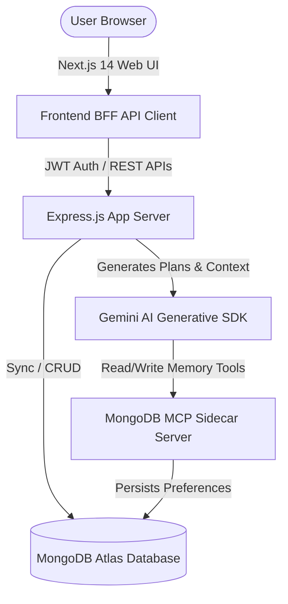

# WorldCup Guardian AI 🛡️✈️
> Hackathon-winning Autonomous AI Agent for managing sports travel, live schedules, expense divisions, and travel emergencies.

Powered by **Gemini 1.5**, **Google Cloud Agent Builder**, **Express**, **Next.js 14**, and **MongoDB Model Context Protocol (MCP)**.

---

## 🌟 Key Features

1. **Autonomous Travel Planner**: Generates full flight, hotel, and match schedules dynamically from a single prompt.
2. **Emergency AI Recalculator**: Automatically adjusts travel itineraries and notifications if flight delays or storm forecasts are simulated.
3. **Budget & splits Tracker**: Computes cost utilization percentages and splits expenses directly with friends.
4. **MongoDB MCP memory client**: Persists user preferences (favorite sports, teams, language) for personalized agent memory.
5. **Interactive UI**: Startup-grade glassmorphic dark mode styled using TailwindCSS, Framer Motion, and Lucide icons.
6. **Voice Input/Output**: Supports speech recognition for agent prompts and text-to-speech for responses.

---

## 🛠️ System Architecture



---

## 🚀 Setup & Execution

### 1. Clone & Setup Workspace
Initialize dependencies for both the frontend, backend, and MCP server:

```bash
# Setup Backend
cd backend
npm install

# Setup Frontend
cd ../frontend
npm install

# Setup MongoDB MCP
cd ../mcp
npm install
```

### 2. Environment Configurations
Create `.env` files in `backend` and `mcp` root folders using the provided `.env.example` templates.

**`backend/.env`:**
```env
PORT=4000
MONGODB_URI=mongodb+srv://<user>:<pwd>@cluster.mongodb.net/worldcup_guardian
JWT_SECRET=supersecretjwtkeyforhackathon2026
GEMINI_API_KEY=your-gemini-api-key
FRONTEND_URL=http://localhost:3000
MCP_SERVER_URL=http://localhost:5000
```

**`mcp/.env`:**
```env
PORT=5000
MONGODB_URI=mongodb+srv://<user>:<pwd>@cluster.mongodb.net/worldcup_guardian
```

### 3. Run Locally

Open three terminal windows to launch the services:

* **Terminal 1: Start MongoDB MCP Server**
  ```bash
  cd mcp
  npm run dev
  ```
* **Terminal 2: Start Express App Server**
  ```bash
  cd backend
  npm run dev
  ```
* **Terminal 3: Start Next.js Development Server**
  ```bash
  cd frontend
  npm run dev
  ```

Once running, visit **`http://localhost:3000`** in your browser!

---

## 🏆 Hackathon Quick-Start Demo Run
For local testing or judging without MongoAtlas or Google OAuth setup, the application operates in **Mock Auth & DB Bypassing Mode** automatically:
1. Load `http://localhost:3000`
2. Click **"Launch AI Agent"**.
3. Use the **Sim Delay** or **Sim Weather** buttons on the top right to watch the itinerary and expense budget instantly recalculate.
4. Interact with the **AI Agent Chat** by inputting:
   - *"I am traveling from India to watch the FIFA World Cup Final."*
   - Observe the step-by-step thinking visualizer execute on the right-hand panel!
