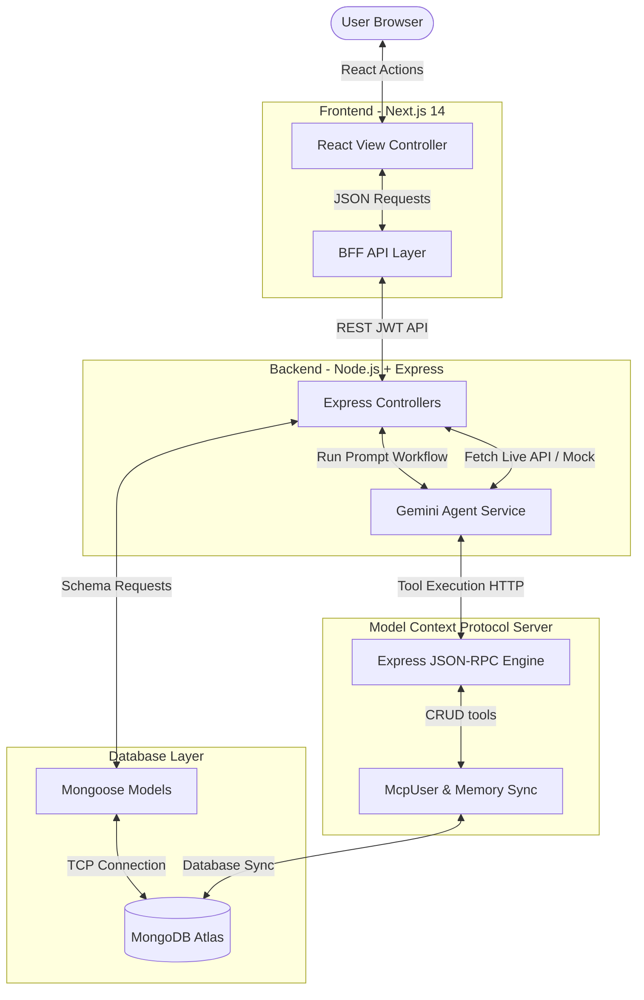

# WorldCup Guardian AI — Hackathon Deliverables

This document consolidates all necessary technical plans, designs, deployment details, and business strategies for submission to the **Global AI Hackathon**.

---

## 1. System Architecture



---

## 2. Database Schema

The database consists of the following key collections in MongoDB Atlas:

```typescript
// Users Collection Schema
{
  _id: ObjectId,
  googleId: String,
  name: String,
  email: String,
  picture: String,
  favoriteSport: String,      // Soccer, Cricket, Olympics
  favoriteTeam: String,
  budgetPreference: String,  // Budget, Moderate, Premium
  languagePreference: String,
  createdAt: Date
}

// Trips Collection Schema
{
  _id: ObjectId,
  userId: ObjectId (ref: 'User'),
  event: String,              // e.g. FIFA World Cup 2026
  destination: String,
  budget: Number,
  startDate: Date,
  endDate: Date,
  status: String,             // planned, active, completed
  itinerary: [{
    id: String,
    day: Number,
    time: String,
    type: String,             // flight, hotel, match, food, sightseeing, other
    title: String,
    description: String,
    location: String,
    cost: Number
  }],
  groupMembers: [String],     // friend emails
  meetingPoints: [{
    name: String,
    lat: Number,
    lng: Number,
    time: String
  }],
  createdAt: Date
}

// Budgets Collection Schema
{
  _id: ObjectId,
  userId: ObjectId (ref: 'User'),
  tripId: ObjectId (ref: 'Trip'),
  estimatedCost: Number,
  actualCost: Number,
  expenses: [{
    id: String,
    description: String,
    amount: Number,
    category: String,         // flight, hotel, match, food, transport, other
    date: Date,
    paidBy: String,
    splitWith: [String]
  }],
  createdAt: Date
}

// Notifications Collection Schema
{
  _id: ObjectId,
  userId: ObjectId (ref: 'User'),
  title: String,
  message: String,
  type: String,               // alert, flight, weather, match, general
  read: Boolean,
  createdAt: Date
}

// History Collection Schema
{
  _id: ObjectId,
  userId: ObjectId (ref: 'User'),
  query: String,
  response: String,
  steps: [{
    title: String,
    description: String,
    status: String,           // success, warning, error, pending
    duration: String
  }],
  createdAt: Date
}
```

---

## 3. API Design

### Authentication Endpoints
- `POST /api/auth/login`: Handles Google OAuth credentials verification or bypass simulation, signs JWT cookie.
- `POST /api/auth/logout`: Invalidates the session.
- `GET /api/auth/profile`: Gets the authenticated user's settings.
- `PUT /api/auth/profile`: Updates favorite sports/teams memory.

### AI Agent Endpoints
- `POST /api/agent/chat`: Runs multi-step planning and tool orchestration.
- `GET /api/agent/history`: Retrieves AI conversation history.

### Trips Endpoints
- `GET /api/trips`: Fetches active itineraries.
- `POST /api/trips`: Saves new manual travel plan.
- `PUT /api/trips`: Updates scheduled dates/items.
- `DELETE /api/trips`: Deletes trip.

### Budgets & Splits Endpoints
- `GET /api/budget`: Retrieves actual spending breakdown.
- `POST /api/budget`: Adds a shared/divided expense item.

---

## 4. MCP Integration

WorldCup Guardian AI implements the **Model Context Protocol (MCP)** specification. 
1. The AI Agent utilizes Gemini function declarations matching MCP schemas.
2. In execution, when the user updates preferences or plans a trip, the agent routes transactions through the Express MCP client sidecar.
3. The MCP server hosts MongoDB tools:
   - `save_user_profile`
   - `get_user_profile`
   - `save_itinerary`
   - `save_budget`
4. The MCP sidecar validates JSON-RPC schema requirements and performs safe collection updates on Atlas.

---

## 5. Google OAuth Setup Guide

To configure production-ready Google Authentication:
1. Go to [Google Cloud Console](https://console.cloud.google.com/).
2. Create a new project named **WorldCup Guardian AI**.
3. Search for **OAuth consent screen** and select External. Add app details.
4. Go to **Credentials** -> **Create Credentials** -> **OAuth client ID**.
5. Set Application Type to **Web application**.
6. Authorized JavaScript origins: `http://localhost:3000`.
7. Authorized redirect URIs: `http://localhost:3000/api/auth/callback/google` or `http://localhost:3000/dashboard`.
8. Copy the Client ID and Client Secret to the backend `.env` file.

---

## 6. Deployment Guide

### Deploying the Backend & MCP to Google Cloud Run
Deploying separate containers using Dockerfiles:

1. **Dockerize and push to Artifact Registry:**
   ```bash
   gcloud auth configure-docker
   docker build -t gcr.io/your-project-id/worldcup-backend ./backend
   docker push gcr.io/your-project-id/worldcup-backend
   ```
2. **Deploy to Cloud Run:**
   ```bash
   gcloud run deploy worldcup-backend \
     --image gcr.io/your-project-id/worldcup-backend \
     --platform managed \
     --region us-central1 \
     --allow-unauthenticated \
     --set-env-vars MONGODB_URI="mongodb+srv://..."
   ```

### Deploying the Frontend to Vercel
1. Install vercel CLI: `npm install -g vercel`.
2. Run `vercel` in the `frontend` directory.
3. Add environment variable `NEXT_PUBLIC_API_URL=https://your-cloud-run-backend.run.app`.

---

## 7. Devpost Submission Description

### 🌟 Project Title: WorldCup Guardian AI
**Tagline:** An autonomous, multi-step AI travel agent that plans sports trips, splits expenses, and auto-recalculates itineraries in real-time during flight delays and bad weather.

### 💡 Inspiration
Attending major international sports events like the FIFA World Cup or the Olympic Games is a bucket-list dream, but planning travel paths, aligning stadium ticket times, tracking split costs, and managing sudden changes (like flight delays or extreme rain) is overwhelming. We wanted to build an agent that behaves not as a simple chatbot, but as an autonomous tour guide who stays in control, remembers your preferences, and makes smart planning choices for you.

### ⚙️ What it does
WorldCup Guardian AI acts as your guardian assistant:
1. Plans flights, hotel accommodations, matches, and sightseeing paths in seconds.
2. Synchronizes preferences and itinerary history using a custom MongoDB MCP server.
3. Automatically triggers emergency actions: recalculates itineraries, shifts check-in times, and modifies transit options when delayed flights or severe weather are simulated.
4. Splits group budget items dynamically with travel buddies.
5. Employs advanced voice commands and speech synthesis for accessibility.

---

## 8. 3-Minute Demo Script & Plan

- **[0:00 - 0:30] The Hook**: Start with the problem. Show the landing page, click "Launch AI Agent" to reveal the startup-grade dark glassmorphism dashboard.
- **[0:30 - 1:15] Autonomous Planning**: Ask the agent to plan a World Cup trip. Highlight the step-by-step Execution Steps visualizer (Intent analyzed, flights checked, lodging mapped, MongoDB memory committed).
- **[1:15 - 2:00] Emergency Simulation**: Simulate a flight delay with the top right button. Show the immediate response: notifications feed warning the user, and the itinerary timeline shifting to show rescheduled timings.
- **[2:00 - 2:30] Budgets & Splits**: Show the budgets tab. Explain how expenses are categorized and split among friends using MongoDB.
- **[2:30 - 3:00] Memory & Wrap-up**: Explain the MongoDB MCP integrations, preferences sync, and why this is a first-place hackathon contender.

---

## 9. Future Scalability & Startup Business Model

### Scalability
- **WebSocket Gateway**: Integrate real-time collaboration so travel groups see updates instantly.
- **GCP Agent Builder Integration**: Tap directly into flight booking search engines and real-world APIs.
- **Offline PWA support**: Cache itineraries locally so users see transit guides inside stadium zones even without mobile signal.

### Business Model (SaaS / Transactional)
- **Affiliate Commissions**: Earn commissions on flights, hotel bookings, and stadium shuttle tickets reserved via the app.
- **Premium Tier**: Subscription fee for real-time flight rebooking auto-triggers and VIP airport lounge lounge finder alerts.
